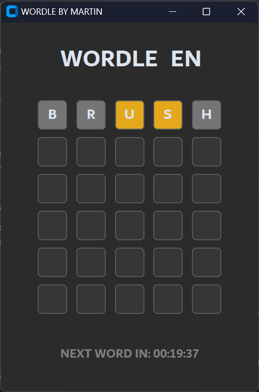
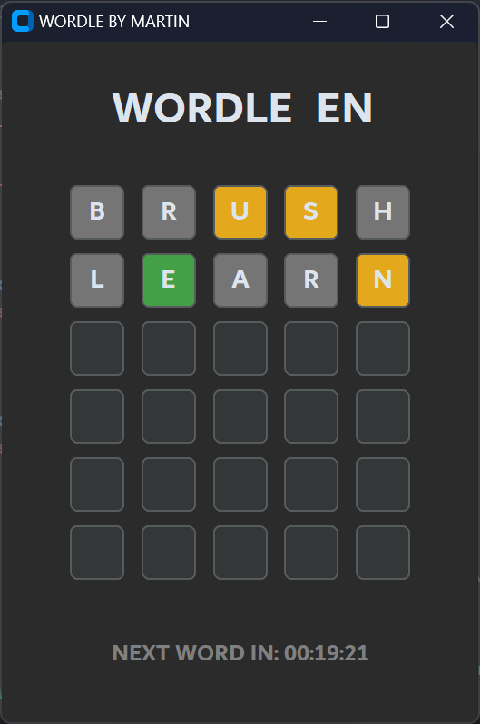
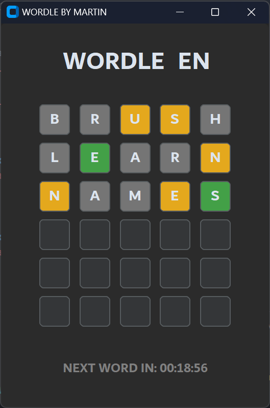
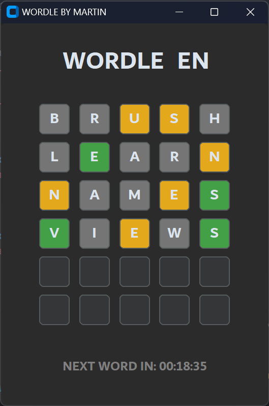
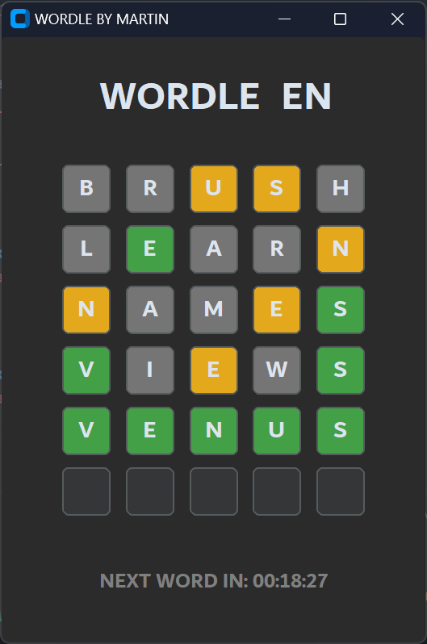

# Wordle

This is in three idioms: Spanish (ES), Catalan (CA), and English (EN).

Just like the original game, you have 6 attempts to guess the random word and it gets updated every day at 00:00 🕛  
🟩 -> correct letter in correct place  
🟧 -> correct letter in incorrect place  
⬜️ -> incorrect letter  

It will let you know if yu are writting some letter that you already know it's not in the word and it doesn't let you write words that doesn't exist in the dictionary.

It's written in **Python** and I used **TKinter** library for the UI and **SQLite** for database.

